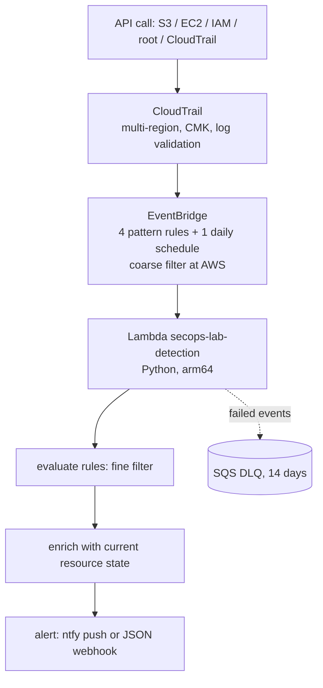

# aws-secops-lab

Event-driven security detection on AWS: fully in Terraform, detection logic in Python,
scanned and tested in CI before every rollout.

Goal: from "AWS and Terraform are listed on my profile" to "here is the repo, with commits and
dates". This project was built to turn claimed AWS/Terraform skills into verifiable evidence,
and to learn. It deliberately targets exactly the skill set that security-automation roles
ask for.

> Code comments and commit messages are in Dutch (this was also a learning journal); the
> README, architecture and threat model below tell the full story in English.

## Architecture



The coarse filter (which eventNames are relevant at all) lives in the EventBridge patterns,
so irrelevant calls cost no Lambda invocations. The fine judgment (is this `PutBucketAcl`
really public?) lives in Python, where it is unit-testable.

## Detection rules

| Rule | What | Severity | Proven live |
|---|---|---|---|
| S3-PUBLIC-001 | bucket made public via ACL, policy with `Principal:*`, or public access block removed/weakened | HIGH/MEDIUM | finding 10 s after weakening the PAB |
| IAM-ROOT-002 | any manual root usage (AWS service actions excluded) | HIGH | unit tests |
| EC2-SG-003 | security group open to 0.0.0.0/0 or ::/0; HIGH on management/db ports or all traffic | HIGH/MEDIUM | finding 3 s after world-open SSH |
| CT-TAMPER-004 | CloudTrail stopped/deleted (CRITICAL) or modified (HIGH) | CRITICAL/HIGH | unit tests |
| IAM-KEY-005 | active access key >90 days; HIGH if the user has no MFA (daily audit) | HIGH/MEDIUM | immediately found 3 real stale keys |

Rules are data: a list of functions in `lambda/src/rules.py` (events) and `lambda/src/audit.py`
(scheduled state checks). Adding a rule = one function + one EventBridge pattern entry +
tests.

## Threat model (short)

**What we protect:** the integrity of the AWS account itself: no silent public data
exposure, no unnoticed use of overly powerful credentials, no disabled audit trail.

**Against whom/what:**

| Threat | Detection | Limitation |
|---|---|---|
| Leaked key makes a bucket public (exfiltration preparation) | S3-PUBLIC-001, within seconds | detection is not prevention; the guardrail itself is the account-wide public access block |
| Attacker with root credentials | IAM-ROOT-002 | console sign-ins land as a global event in us-east-1; this stack catches regional root API calls. Cross-region forwarding is on the roadmap |
| Management port open to the internet (entry point for brute force) | EC2-SG-003 | only `AuthorizeSecurityGroupIngress`; existing old rules are only caught by a (future) audit |
| Attacker turns off the cameras before the break-in | CT-TAMPER-004 | if the attacker can also destroy the Lambda/EventBridge, the detection itself is the target; that requires org-level guardrails (SCPs), out of scope for a single account |
| Stale, MFA-less credentials as a silent backdoor | IAM-KEY-005, daily | the audit runs once per day; a key that leaks in the morning is only seen at night |

**Assumptions:** the deploy user is trusted; the state bucket is encrypted and not public;
alerts contain the account number and resource names and therefore go over https only.

**Detection protects itself:** trail tampering is itself a CRITICAL rule, the Lambda role can
create or modify nothing (read + log + its own DLQ only), and the DLQ retains failed events
for 14 days.

## Why this project and not something else

Security-automation roles ask for: Python, AWS, Terraform, IAM, REST APIs, DevSecOps. This
project touches all six in a setup small enough to finish and real enough to show.

| Skill asked for | Where it lives here |
|---|---|
| Terraform | the full infrastructure in `terraform/`, modules, S3 backend with locking, nothing clicked together by hand |
| AWS | S3, IAM, KMS, CloudTrail, Lambda, EventBridge, SQS, X-Ray, Budgets |
| IAM | least-privilege roles per function: exact actions on exact resources, every wildcard justified in the code |
| Python | detection engine + 38 unit tests (moto) in `lambda/` |
| REST APIs | findings as a JSON webhook or ntfy push to an HTTPS endpoint |
| DevSecOps | CI scans the IaC with tfsec and checkov and runs pytest before anything rolls out |

## Method note

Built AI-assisted, with the discipline that makes that safe: every change had to pass the
full test suite, tfsec, checkov and CI before landing, and every detection claim above was
proven against a live account before it went in this README.

## Scanner policy

tfsec and checkov are green. Findings have three possible outcomes, never silent suppression:

1. **Actually fix it**: CMK encryption, X-Ray, DLQ, 365d retention, EventBridge notifications.
2. **Comply honestly at no cost**: SSE-SQS on the DLQ, arm64.
3. **Reject with an argument**: the rationale sits as a comment on the skip line in the code
   itself (KMS key policy false positives, reserved concurrency made impossible by account
   quotas, wildcards necessary for detection reads).

## Week plan

| Day | Goal | Status |
|---|---|---|
| 1 | Backend, CloudTrail stack, budget, CI with scanners | ✅ 2026-08-24 |
| 2 | Detection Lambda + rule 1 (public S3 bucket), moto tests, module with least-privilege role | ✅ 2026-08-24, proven live |
| 3 | Rules 2 through 5 + daily audit schedule | ✅ 2026-08-24, proven live |
| 4 | Alerts end-to-end on the phone (ntfy) | ✅ 2026-08-26, proven live |
| 5 | (deferred) deepening: cross-region root events, SG audit | |
| 6 | Documentation: architecture, threat model, README | ✅ this document |
| 7 | `terraform destroy`, costs to zero, repo public | ✅ 2026-08-27: infra destroyed, costs verified at $0.00, repo made public |

## Sibling project

On-demand instead of event-driven: https://github.com/OmniNomadLLC/aws-audit-mcp
offers the same audit domains as read-only MCP tools to AI agents.

## Running it

```bash
export AWS_PROFILE=secops-lab
export TF_VAR_budget_alert_email=...   # never in the repo
export TF_VAR_alert_endpoint=...       # https, optional: empty = log-only
terraform -chdir=terraform init
terraform -chdir=terraform plan
pytest lambda -q
```

## Costs

Nearly everything within the free tier: one free CloudTrail trail, Lambda 1M requests/month
free, X-Ray 100k traces free, SQS/EventBridge negligible. The only fixed cost is the CMK
(~$1/month, deliberately: real encryption instead of scanner suppression). A $10 monthly
budget with email alerts sits in Terraform as a safety net. At the end: `terraform destroy`
and everything back to zero.
